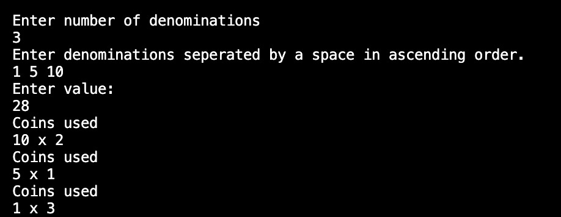
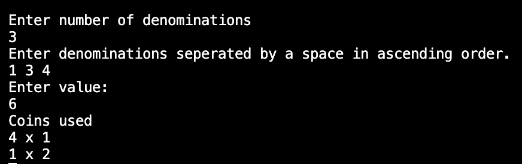
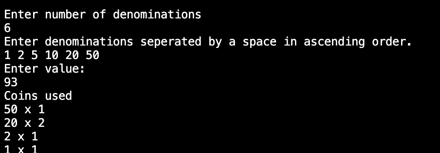

## 1. Propose a greedy strategy and justify why it works for certain coin systems. 
Strategy - Always pick the highest denomination coin that is less than or equal to the remaning amount. 

### Algorithm 
```
ALG COIN(): 
    // input - coins with certain denominations ; amount to be calculated for 
    // output - number of coins required 
    c <- 0 
    for i<- n-1 to 0 do:
        c<- c+ amount/denomination[i] 
        amount <- amount + denomination[i]
    return c 
```
Given that the denominations are given in sorted order - ascending. 

### Why is only works for certain coin systems: 
Greedy approach only works for "canonical coin systems". These systems are when choosing the largest coin never prevents reaching the optimal solution (minimum number).
In the other systems, it may give out suboptimal answers - does not give the correct solution. 

## 2. Implement the Algorithm 
Check main.c

## 3.  Discuss cases where the greedy strategy may not yield the optimal solution (eg.,coins {1, 3, 4} for amount 6)
Using the example provided - {1,3,4} ; amount = 6 
Refer above - this is a case of a non canonical coin system. 
If we were to go about this using the greedy approach 
``` Max Value = 4 
    6 - 4 = 2
    Max Value = 1 
    2 - 1 = 1
    Max Value = 1
``` 
This requires 3 coins 

But in the optimal way, the answer would be 
    ```3 + 3 = 6 ```
which requires only 2 coins. 

Another example would be {1,5,6,9}; amount = 11 
```Using greedy: 
    9 + 1 + 1 = 11 
    3 coins. 
Using optimal: 
    5 + 6 = 11
    2 coins.
```

## 4. Use an appropriate data structure to efficiently track coins. 
An array would be used. 

## 5. Analyze the time complexity.  
Input = n (denominations)
Basic Operation = Division.
Depends on = Input only. 

The time complexity would be Θ(n). 

## 6. Test the algorithm on different coin systems and amounts, reporting results. 


Canonical Form



Non Canonical Form 



Canonical Form
